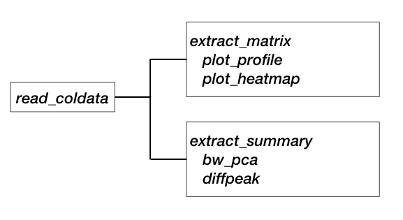

# An R package for rapid bigWig file summarization/analysis.

### Note: Under active development.

### Introduction
Typical workflow for ChIP-seq analysis includes manipulation of BigWig files, which provide input data for various downstream analyses and plotting. Processing BigWig files is often slower in R or Python leading to time consuming processes. Current package utilizes [bwtool](https://github.com/CRG-Barcelona/bwtool) for rapid BigWig file operations followed by data.table and base plot functions in R for faster data summarization/visualization. 


### Requirement
Install [bwtool](https://github.com/CRG-Barcelona/bwtool) and make sure its under PATH. Once installed, run below command in R to make sure it is accessible.
```r
peakSeason::check_bwtools()
```

### Usage
All you need is a tsv file or a data.frame of bigWig files to be analyzed. You can add any sort of metadata such as condition, treatment, etc - similar to `coldata` in RNA-Seq analysis. Example:

```r
                                        files    sample_names  condition
     ./macs_op/Dnd41_H3K27ac/Dnd41_H3K27ac.bw   Dnd41_H3K27ac        ALL
 ./macs_op/Jurkat1_H3K27ac/Jurkat1_H3K27ac.bw Jurkat1_H3K27ac        ALL
     ./macs_op/MOLT3_H3K27ac/MOLT3_H3K27ac.bw   MOLT3_H3K27ac        ALL
     ./macs_op/MOLT4_H3K27ac/MOLT4_H3K27ac.bw   MOLT4_H3K27ac        ALL
         ./macs_op/Th1_H3K27Ac/Th1_H3K27Ac.bw     Th1_H3K27Ac Thymocytes
         ./macs_op/Th2_H3K27Ac/Th2_H3K27Ac.bw     Th2_H3K27Ac Thymocytes
```

Once you have the above information, usage is simple. A flow chart as below (for now - will update with more features gradually).

<p align="center">

</p>

### Installation
```r
devtools::install_github(repo = "PoisonAlien/peakSeason")
```

## To Do
### Analysis

- [x] bigWig summarization (`extract_summary`, `extract_matrix`)
- [x] Sample clustering (`bw_pca`)
- [ ] RNA-Pol2 pausing Index estimation
- [ ] Super enhancer detection
- [ ] RNA and ChIP correlation

### Visualization

- [x] Profile plot (`plot_profile`)
- [x] Heatmap (`plot_heatmap`)
- [x] Homer annotation pie charts
- [ ] Track plots
- [ ] Waterfall plots
- [ ] MA plots

### Documentation
- [ ] Write a vignette
- [ ] Update with proper README
